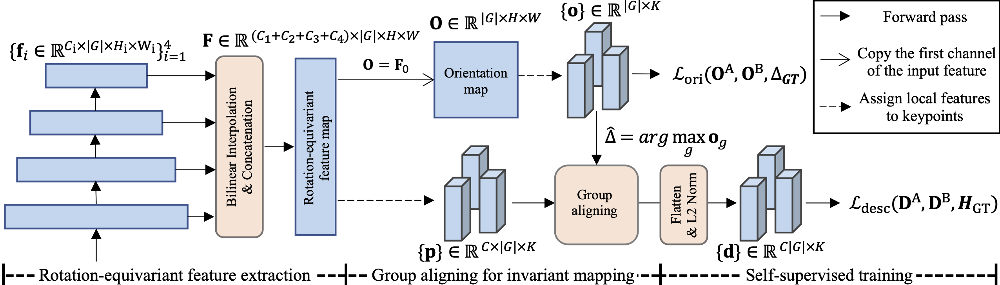
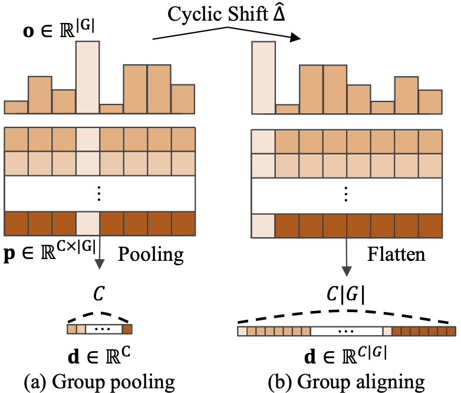
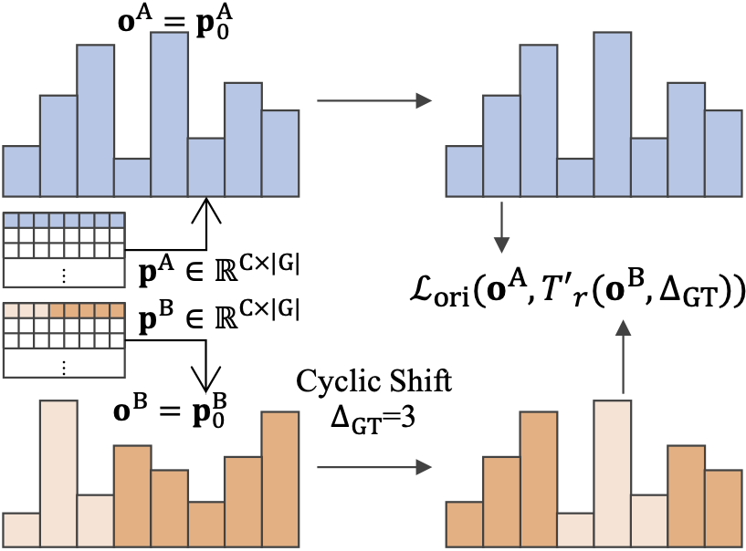

#  Learning Rotation-Equivariant Features for Visual Correspondence (CVPR 2023)


This is the official implementation of the CVPR 2022 paper "Learning Rotation-Equivariant Features for Visual Correspondence" by [Jongmin Lee](https://bluedream1121.github.io/), Byungjin Kim, [Seungwook Kim](https://wookiekim.github.io/), and [Minsu Cho](http://cvlab.postech.ac.kr/~mcho/).


<p float="left">
    
</p>


Extracting discriminative local features that are invariant to imaging variations is an integral part of establishing correspondences between images. In this work, we introduce a self-supervised learning framework to extract discriminative rotation-invariant descriptors using group-equivariant CNNs. Thanks to employing group-equivariant CNNs, our method effectively learns to obtain rotation-equivariant features and their orientations explicitly, without having to perform sophisticated data augmentations. The resultant features and their orientations are further processed by group aligning, a novel invariant mapping technique that shifts the group-equivariant features by their orientations along the group dimension. Our group aligning technique achieves rotation-invariance without any collapse of the group dimension and thus eschews loss of discriminability. The proposed method is trained end-to-end in a self-supervised manner, where we use an orientation alignment loss for the orientation estimation and a contrastive descriptor loss for robust local descriptors to geometric/photometric variations. Our method demonstrates state-of-the-art matching accuracy among existing rotation-invariant descriptors under varying rotation and also shows competitive results when transferred to the task of keypoint matching and camera pose estimation.


<p float="left">
   
     
</p> 
<p style="text-align: center;">
  <em >(Left) Group Pooling vs. Group Aligning,  (Right) Orientation Alignment Loss </em>
</p>

## Rotation-Equivariant Features, Rotation-Invariant Descriptors

PyTorch source code for CVPR2023 paper.

```text
"Learning Rotation-Equivariant Features for Visual Correspondence".
Jongmin Lee, Byungjin Kim, Seungwook Kim, Minsu Cho. CVPR 2023.
```
[[Paper (ArXiv)](https://arxiv.org/abs/2303.15472)]
[[Paper (OpenAccess)](https://openaccess.thecvf.com/content/CVPR2023/papers/Lee_Learning_Rotation-Equivariant_Features_for_Visual_Correspondence_CVPR_2023_paper.pdf)]
[[Project page](http://cvlab.postech.ac.kr/research/RELF/)]


## Installation


#### Clone the Git repository
```bash
git clone https://github.com/bluedream1121/RELF.git
```

#### Install dependency
Run the script to install all the dependencies. You need to provide the conda install path (e.g. ~/anaconda3) and the name for the created conda environment.

```
bash installation.sh [conda_install_path] RELF
```

#### Requirements

* Ubuntu 22.04
* python 3.10
* pytorch 2.0.0
* torchvision 0.15.0
* kornia 0.4.1
* opencv-python 4.7.0.72
* e2cnn 0.2.3


## Dataset preparation

#### Training data & Evaluation data

1. Download the [train-2014](http://images.cocodataset.org/zips/train2014.zip) and [val-2014](http://images.cocodataset.org/zips/val2014.zip) set of COCO dataset.

2. Download the evaluation dataset, Roto-360 (1.93G) [[Download Roto-360](https://postechackr-my.sharepoint.com/:u:/g/personal/ljm1121_postech_ac_kr/ESu4ZhP1WlZFiU7PjeBYbo4B_6bUARcvsqJERgp6dfpBdw?e=2FDAcd)] (Password: relf)

3. Download the evaluation dataset, HPatches (2.02G) [[Download HPatches](https://postechackr-my.sharepoint.com/:u:/g/personal/ljm1121_postech_ac_kr/EXP5SJB2QeFLsdcYQsIyiTQBBi66Wdk0u5rNXgIRicRJag)] (Password: relf)


4. Organize files like the following
```
data
├── roto360/
├── hpatches-sequences-release/
└── coco/
    ├── train2014/ 
    └── val2014/
```


## Training 

``` Orientation=16 python train.py --model 're_resnet'  ```

``` python train.py  --model e2wrn16_8R_stl  ```

  * Hyperparameters:

      * model: The name of backbone network. 
        * ``` 're_resnet'```: Rotation-Equivariant ResNet-18 
        * ``` 'e2wrn16_8R_stl'```: Rotation-Equivariant Wide-ResNet-16-8
      * num_group: The order of rotation group. default=16
      * channels: The number of channels of the ReResNet. default=64
      * training_breaker: The number of training iteration per epoch. default=1000

## Test on the Roto-360

You can download the pretrained weights in here: [[best models](https://postechackr-my.sharepoint.com/:u:/g/personal/ljm1121_postech_ac_kr/EVLMivh7mdVEtICmG6YcrlcBudzXmrKe-8YLyLKLg7VKQg?e=V7J5qQ)] (password : relf).


``` Orientation=16 python evaluate.py --eval_dataset roto360 --model 're_resnet' --load_dir [Trained_models] ``` 


  * load_dir: Path of pre-trained weights.
  * eval_dataset: The name of evaluation dataset: ```roto360```, ```hpatches```.
  * candidate: Multiple descriptor extraction strategy. Default: top1 (No multiple extraction) or 0.6. 
  * detector: The name of keypoint detector.


<details>
<summary><b>Roto-360 Results</b></summary> 


Results on the Roto-360 dataset. `*' denotes the results with the multiple descriptor extraction by orientation candidnates. 

The models are evaluated using all 360 image pairs.

|          Model         |  MMA@3 | MMA@5 | MMA@10 |  pred. match. |   total points       |                                Links                       | Notes                    |
|:----------------------:|:-----:|:-------:|:-----:|:-------:|:-------:|:-------------------------------------------------------------------------------------------:|--------------------------|
| REKD_release | 90.18 |  91.34  |  93.08   |  688.2  |  1160.7  |  [model](https://postechackr-my.sharepoint.com/:u:/g/personal/ljm1121_postech_ac_kr/EVLMivh7mdVEtICmG6YcrlcBudzXmrKe-8YLyLKLg7VKQg?e=V7J5qQ) | Official pretrained model |
| REKD_release* | 91.69 |  92.82  | 94.34 |  1332.8 |  2339.5 |  [model](https://postechackr-my.sharepoint.com/:u:/g/personal/ljm1121_postech_ac_kr/EVLMivh7mdVEtICmG6YcrlcBudzXmrKe-8YLyLKLg7VKQg?e=V7J5qQ) | Official pretrained model |


```bash 
<REKD_release>
Orientation=16 python evaluate.py --eval_dataset roto360 --model 're_resnet' --load_dir [Trained_models]

<REKD_release*>
Orientation=16 python evaluate.py --eval_dataset roto360 --model 're_resnet' --load_dir [Trained_models] --candidate 0.6 
```


</details>

## Test on the HPatches

You can download the pretrained weights in here: [[Re-ResNet-18](https://postechackr-my.sharepoint.com/:u:/g/personal/ljm1121_postech_ac_kr/EVLMivh7mdVEtICmG6YcrlcBudzXmrKe-8YLyLKLg7VKQg?e=V7J5qQ)] 
[[Re-WideResNet-16-8](https://postechackr-my.sharepoint.com/:u:/g/personal/ljm1121_postech_ac_kr/Edytrr1OgudPjbuQ7hk8oRoBjQUl5Vse12_3aZ_wvxZHsg?e=HSoYW4)]
 (password : relf).

``` Orientation=16 python evaluate.py --eval_dataset hpatches --model 're_resnet'   --load_dir  best_model.pt  ```
  
``` Orientation=16 python evaluate.py --eval_dataset hpatches --model 're_resnet'   --load_dir  best_model.pt  --candidate 0.6 ```

``` python evaluate.py --eval_dataset hpatches --model e2wrn16_8R_stl          --load_dir best_model_wrn.pt  --multi_gpu 0  ```

  * model: The name of backbone network. 
    * ``` 're_resnet'```: Rotation-Equivariant ResNet-18 
    * ``` 'e2wrn16_8R_stl'```: Rotation-Equivariant Wide-ResNet-16-8
  * load_dir: Path of pre-trained weights.
  * eval_dataset: The name of evaluation dataset: ```roto360```, ```hpatches```.
  * candidate: Multiple descriptor extraction strategy. Default: top1 (No multiple extraction) or 0.6. 
  * detector: The name of keypoint detector.


<details>
<summary><b>HPatches viewpoint variations</b></summary> 

Results on HPatches  viewpoint variations. `*' denotes the results with the multiple descriptor extraction by orientation candidnates. &dagger; denotes a trained model with larger backbone size (Re-WideResNet16-8).

|          Model         |  MMA@3 | MMA@5 | MMA@10 |  pred. match. |   total points       |                                Links                       | Notes                    |
|:----------------------:|:-----:|:-------:|:-----:|:-------:|:-------:|:-------------------------------------------------------------------------------------------:|--------------------------|
| REKD_release | 63.96 |  70.97  |  77.76   |  512.1  |  1126.1  |  [model](https://postechackr-my.sharepoint.com/:u:/g/personal/ljm1121_postech_ac_kr/EVLMivh7mdVEtICmG6YcrlcBudzXmrKe-8YLyLKLg7VKQg?e=V7J5qQ) | Official pretrained model |
| REKD_release* | 67.45 |  74.62  | 81.12 |  1010.7 |  2175.9 |  [model](https://postechackr-my.sharepoint.com/:u:/g/personal/ljm1121_postech_ac_kr/EVLMivh7mdVEtICmG6YcrlcBudzXmrKe-8YLyLKLg7VKQg?e=V7J5qQ) | Official pretrained model |
| REKD_release&dagger; |  70.05  |  78.06  | 84.92 |  630.9 |  1126.1 |  [model](https://postechackr-my.sharepoint.com/:u:/g/personal/ljm1121_postech_ac_kr/Edytrr1OgudPjbuQ7hk8oRoBjQUl5Vse12_3aZ_wvxZHsg?e=HSoYW4) | Official pretrained model |


```bash 
Orientation=16 python evaluate.py --eval_dataset hpatches --model 're_resnet'   --load_dir  best_model.pt 
  
Orientation=16 python evaluate.py --eval_dataset hpatches --model 're_resnet'   --load_dir  best_model.pt  --candidate 0.6

python evaluate.py --eval_dataset hpatches --model e2wrn16_8R_stl          --load_dir best_model_wrn.pt  --multi_gpu 0 

```


</details>


<details>
<summary><b>HPatches illumination variations</b></summary> 

Results on HPatches illumination variations. `*' denotes the results with the multiple descriptor extraction by orientation candidnates. &dagger; denotes a trained model with larger backbone size (Re-WideResNet16-8).


|          Model         |  MMA@3 | MMA@5 | MMA@10 |  pred. match. |   total points       |                                Links                       | Notes                    |
|:----------------------:|:-----:|:-------:|:-----:|:-------:|:-------:|:-------------------------------------------------------------------------------------------:|--------------------------|
| REKD_release | 63.06 |  70.50  |  77.65   |  512.1  |  1126.1  |  [model](https://postechackr-my.sharepoint.com/:u:/g/personal/ljm1121_postech_ac_kr/EVLMivh7mdVEtICmG6YcrlcBudzXmrKe-8YLyLKLg7VKQg?e=V7J5qQ) | Official pretrained model |
| REKD_release* | 65.35 |  73.01  | 80.21 |  1010.7 |  2175.9 |  [model](https://postechackr-my.sharepoint.com/:u:/g/personal/ljm1121_postech_ac_kr/EVLMivh7mdVEtICmG6YcrlcBudzXmrKe-8YLyLKLg7VKQg?e=V7J5qQ) | Official pretrained model |
| REKD_release&dagger; | 69.50   | 78.02   |  85.37   |  630.9 |  1126.1 |  [model](https://postechackr-my.sharepoint.com/:u:/g/personal/ljm1121_postech_ac_kr/Edytrr1OgudPjbuQ7hk8oRoBjQUl5Vse12_3aZ_wvxZHsg?e=HSoYW4) | Official pretrained model |


```bash 
Orientation=16 python evaluate.py --eval_dataset hpatches --model 're_resnet'   --load_dir  best_model.pt 
  
Orientation=16 python evaluate.py --eval_dataset hpatches --model 're_resnet'   --load_dir  best_model.pt  --candidate 0.6

python evaluate.py --eval_dataset hpatches --model e2wrn16_8R_stl          --load_dir best_model_wrn.pt  --multi_gpu 0 

```


</details>


## Citation
If you find our code or paper useful to your research work, please consider citing our work using the following bibtex:
```
@InProceedings{Lee_2023_CVPR,
    author    = {Lee, Jongmin and Kim, Byungjin and Kim, Seungwook and Cho, Minsu},
    title     = {Learning Rotation-Equivariant Features for Visual Correspondence},
    booktitle = {Proceedings of the IEEE/CVF Conference on Computer Vision and Pattern Recognition (CVPR)},
    month     = {June},
    year      = {2023},
    pages     = {21887-21897}
}
```

## Acknowledgements
  We would like to thank the following papers for their github source code contributions.

  We rely heavily on the following three repositories. 
  * [GIFT: Learning Transformation-Invariant Dense Visual Descriptors via Group CNNs](https://github.com/zju3dv/GIFT) (NeurIPS 2019)
  * [ReDet: A Rotation-equivariant Detector for Aerial Object Detection](https://github.com/csuhan/ReDet)
  * [Self-Supervised Equivariant Learning for Oriented Keypoint Detection](https://github.com/bluedream1121/REKD) (CVPR 2022)

  We use some functions from the following three repositories.
  * [Self-Supervised Learning of Image Scale and Orientation Estimation](https://github.com/bluedream1121/self-sca-ori) (BMVC 2021)
  * [R2D2: Repeatable and Reliable Detector and Descriptor](https://github.com/naver/r2d2) (NeurIPS 2019)
  * [Key.Net: Keypoint Detection by Handcrafted and Learned CNN Filters](https://github.com/axelBarroso/Key.Net) (ICCV 2019)

## Contact

Questions can be left as issues in the repository. 